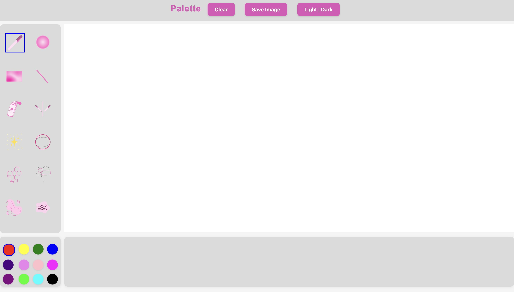
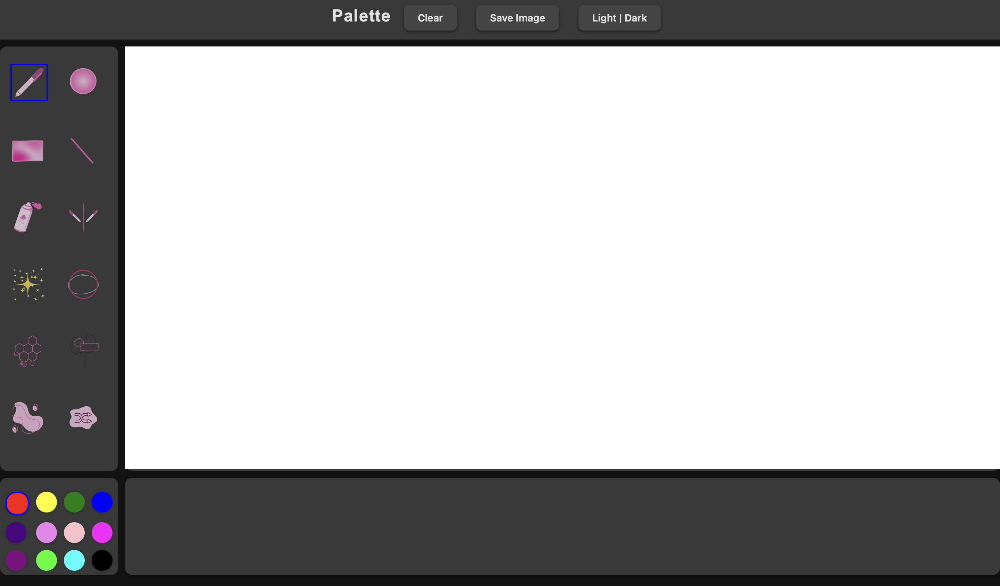

# Palette (My Drawing App)

### **Overview**  
This project is a feature-rich drawing application that combines creativity with **interactive game elements** to enhance user engagement. The app includes a variety of tools for drawing and creativity, as well as game-like challenges to provide a unique and enjoyable user experience.

---

### **Goals**  
1. Provide a versatile and engaging drawing platform for creative and playful users.  
2. Introduce interactive games to encourage skill-building and memory challenges alongside free-form creativity.  
3. Ensure smooth performance and an intuitive user interface.

---

### **Core Features**  

#### **Drawing Tools**  
- **Freehand Tool**: Allows users to draw freely on the canvas.  
- **Line, Rectangle, and Ellipse Tools**: Standard tools for creating precise shapes.  
- **Interactive Tools**:  
   - **Spray Can Tool**: Mimics spray paint effects using particle-based logic.  
   - **Editable Shapes Tool**: Allows users to modify shapes after drawing.  
   - **Mirror Draw Tool**: Reflects user drawings across an axis for symmetry.  
   - **Sparkle Effect**: Adds dynamic sparkles to the canvas for enhanced visuals.  

#### **Game Features**  
- **Shape Memory Game**:  
   - Users replicate shapes shown briefly on the screen.  
   - Includes logic for generating shapes and comparing user input.  
- **Circle Draw Game**:  
   - Users attempt to draw circles as accurately as possible.  
   - Incorporates timers and geometric accuracy checks for feedback.  

#### **User Interface**  

- **Responsive Layout**: Grid-based design featuring:  
   - **Sidebar**: Tool selection.  
   - **Color Palette**: For color customization.  
   - **Header Options**: Clear canvas, Save Image, and Dark Mode toggles.  
- **Dark Mode**: A toggleable dark mode for improved accessibility and user comfort during extended sessions.
- 

---

### **Milestones**  

| **Milestone**                        | **Description**                                      | **Timeline**   |  
|-------------------------------------|-----------------------------------------------------|----------------|  
| **Milestone 1**: Research & Design  | UI mockups, tool logic, and flow diagrams.          | Week 1–2       |  
| **Milestone 2**: Core Tool Development | Implement Freehand, Line, Rectangle, Ellipse tools, and Dark Mode. | Week 2–4       |  
| **Milestone 3**: Interactive Features | Develop Spray Can Tool, Editable Shapes Tool, and Sparkle Effects. | Week 5–6       |  
| **Milestone 4**: Game Development   | Finalize Shape Memory and Circle Draw Games.        | Week 6–7       |  
| **Milestone 5**: UI Refinement & Testing | Optimize UI design and fix bugs.                   | Week 7–8       |  
| **Milestone 6**: Final Testing & Documentation | Optimize performance and prepare for submission.   | Week 9–10      |  

---

### **Project Log**  

#### **Week 1–2: Research & Design**  
- Researched existing drawing apps for inspiration.  
- Brainstormed game ideas to combine creativity and interactivity.  
- Designed wireframes: Sidebar for tools, color palette, and header options for accessibility.  

#### **Week 2–4: Core Tool Development**  
- Added **Freehand, Line, Rectangle**, and **Ellipse Tools** using p5.js.  
- Integrated the **Color Palette** for brush customization.  
- Implemented **Dark Mode**, using CSS class toggles for light/dark themes.

#### **Week 5–6: Interactive Features**  
- Developed **Sparkle Effect** using randomness for position and opacity.  
- Started **Editable Shapes Tool** to allow real-time modifications of shapes.  
- **Color Palette (Rainbow Attempt)**: Attempted to implement a rainbow gradient palette but faced difficulties with dynamic color rendering.  

#### **Week 6–7: Game Development**  
- **Shape Memory Game**: Logic for displaying and comparing shapes implemented.  
- **Circle Draw Game**: Added timers and accuracy checks using distance calculations.  

#### **Week 7–8: UI Refinement & Testing**  
- Polished the interface and ensured all tools are accessible.  
- Conducted **Dark Mode testing** and fixed visibility bugs.  
- Added tooltips for tool buttons and resolved bugs with shape tools.

#### **Week 9–10: Final Testing & Documentation**  
- Optimized performance for handling multiple tools and games.  
- Conducted user testing to identify and fix UI and logic issues.  
- Finalized documentation and prepared for project submission.  

---

### **Future Plans**  
1. **Rainbow Color Palette**: Revisit the smooth gradient color palette for a more dynamic user experience.  
2. **Advanced Game Features**: Introduce new games, such as timed drawing challenges and scoring systems.  
3. **Brush Customization**: Add options for brush textures, thickness controls, and opacity settings.  
4. **Cross-Platform Support**: Make the app available for mobile devices and tablets.  

---

### **Technologies Used**  
- **p5.js**: Core library for rendering, shapes, and event handling.  
- **HTML/CSS**: For structuring the user interface and styling (including Dark Mode).  
- **JavaScript**: Game logic, tool implementation, and interactivity.  

---

### **Author**  
**Roya Nikseresht**  
Email: [rn211@student.london.ac.uk](mailto:rn211@student.london.ac.uk)  
